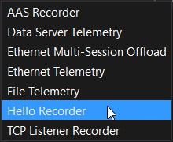
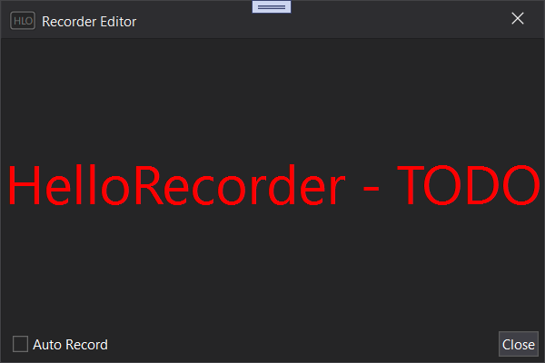

# MAT.Atlas.Plugins.HelloRecorder

An example of the simplest possible custom A10 recorder. 

The project requires ATLAS 10 to be installed to build. 
It references libraries from ATLAS 10 installed into the default path (`c:\Program Files\McLaren Applied Technologies\ATLAS 10\`). If ATLAS 10 is installed into a different folder, the references (`MAT.Atlas.Api.dll`, `MAT.Atlas.Api.Core.dll`, `MAT.Atlas.Api.Presentation.dll`, `MAT.OCS.Core.dll`) must be replaced. 

To run build and copy either the debug or the release version of `MAT.Atlas.Plugins.HelloRecorder.dll` to ATLAS 10 installation folder (`C:\Program Files\McLaren Applied Technologies\ATLAS 10` by default)

It will show in Add Recorder menu in Session Browser: 

After created, it will allow you to show configuration dialog: 

